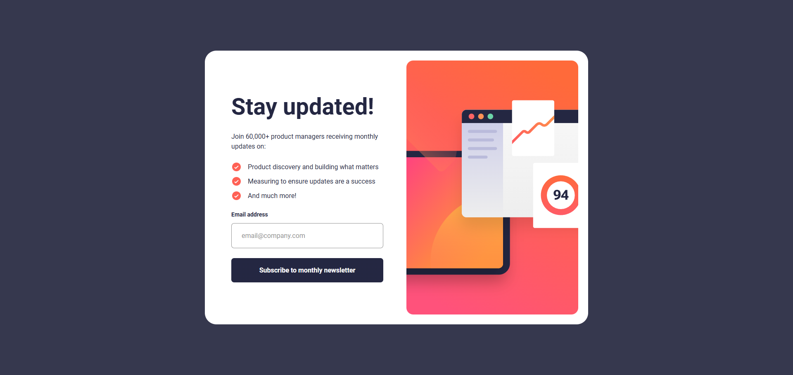

# 📣 Frontend Mentor - Solución del reto Newsletter sign up form with success message

Esta es mi solución al reto [Article preview component](https://www.frontendmentor.io/challenges/article-preview-component-dYBN_pYFT).

## Tabla de contenidos

- [Resumen](#resumen)
  - [El reto](#el-reto)
  - [Captura de pantalla](#captura-de-pantalla)
  - [Enlaces](#enlaces)
- [Mi proceso](#mi-proceso)
  - [Construido con](#construido-con)
  - [Lo que aprendí](#lo-que-aprendí)
  - [Desarrollo continuo](#desarrollo-continuo)
  - [Recursos útiles](#recursos-útiles)
- [Autor](#autor)
- [Agradecimientos](#agradecimientos)

## 💻 Resumen

### El reto

Los usuarios deberían poder:

- Introducir su correo electrónico y enviar el formulario
- Ver un mensaje de confirmación que incluya su correo electrónico tras enviar el formulario correctamente
- Ver mensajes de validación del formulario si:
  - El campo se deja vacío
  - La dirección de correo electrónico no tiene el formato correcto
- Visualizar la disposición óptima de la interfaz según el tamaño de pantalla de su dispositivo
- Ver los estados de _hover_ (al pasar el cursor) y _focus_ (al enfocar) de todos los elementos interactivos de la página

### Captura de pantalla

### Enlaces

- URL de la solución: https://github.com/angeldavid04/newsletter-sign-up-with-success-message
- URL del sitio en vivo: https://angeldavid04.github.io/newsletter-sign-up-with-success-message

## 💪 Mi proceso

### Construido con

- HTML5 semántico
- JavaScript ES6+
- Propiedades personalizadas de CSS
- Grid
- Flexbox

### Lo que aprendí

Aprendí a manejar formularios de manera accesible e implementar validaciones básicas en el frontend. Asimismo, descubrí la técnica de _debounce_, que en este caso implementé en el código JavaScript para que, cuando el usuario termine de escribir, se muestre el mensaje de validación de forma menos invasiva.

También aprendí a utilizar elementos dialog para crear ventanas modales modernas y accesibles.

### Desarrollo continuo

Espero poder seguir aprendiendo más sobre formularios y formas de maquetación que me permitan hacer páginas bonitas y accesibles.

### Recursos útiles

- [MDN Web Docs](https://developer.mozilla.org/es/) - Este recurso es muy bueno y me ayuda sobre todo a escoger funciones y características que funcionan en cualquier navegador.
- [W3Schools](https://www.w3schools.com/cssref/pr_gen_quotes.php) - Este recurso me ayuda a entender las propiedades CSS cuando tengo dudas.
- [CSS Scan - CSS box shadow examples](https://getcssscan.com/css-box-shadow-examples) - Este recurso me ayuda a escoger sombras para elementos.

## 🤓 Autor

- Frontend Mentor - [Angel López](https://www.frontendmentor.io/profile/AngelDavid-dev)

## ♥️ Agradecimientos

Le quiero dar un agradecimiento a mis maestros del bachillerato porque sin ellos no sería quien soy ahora, JonMircha por ser un gran docente digital y enseñarme los fundamentos del desarrollo web, y a Lucas Dalto por ofrecerme muy buenos cursos para aprender y repasar.
